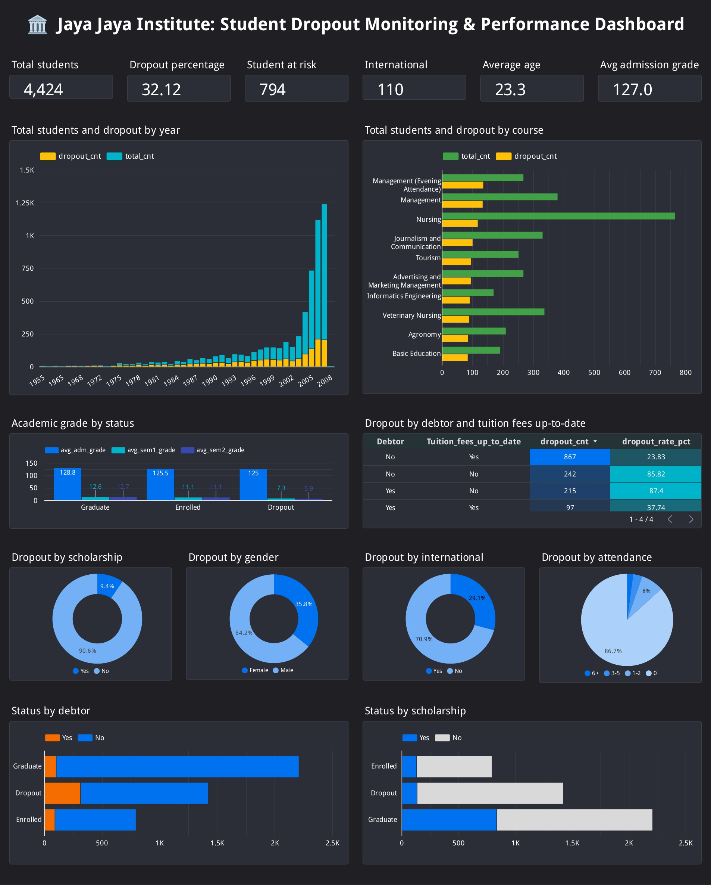

# Menyelesaikan Permasalahan Institusi Pendidikan

## Business Understanding
Jaya Jaya Institute adalah lembaga pendidikan tinggi yang telah berdiri sejak tahun 2000 dan dikenal luas karena kualitas pendidikan yang dihasilkannya. Lulusan dari institusi ini memiliki reputasi yang sangat baik dan banyak yang berkontribusi signifikan di berbagai bidang. Meskipun demikian, salah satu tantangan besar yang dihadapi oleh Jaya Jaya Institute adalah tingginya angka dropout di kalangan mahasiswa. Banyak mahasiswa yang tidak menyelesaikan pendidikan mereka, yang berisiko merusak reputasi institusi tersebut.

Tingginya angka dropout ini menjadi perhatian utama karena dapat mempengaruhi reputasi, akreditasi, dan kepercayaan masyarakat terhadap kualitas pendidikan yang ditawarkan oleh Jaya Jaya Institute. Untuk mengatasi masalah ini, institusi berupaya untuk mendeteksi mahasiswa yang berpotensi mengalami dropout sejak dini. Dengan cara ini, Jaya Jaya Institute dapat memberikan bimbingan khusus kepada mahasiswa tersebut agar mereka dapat menyelesaikan pendidikan mereka dengan sukses dan mengurangi tingkat dropout.

### Business Problem
Jaya Jaya Institute menghadapi tantangan besar dalam menangani tingginya angka mahasiswa yang mengalami dropout. Masalah ini dapat berdampak negatif pada beberapa aspek, antara lain:
- Reputasi dan Akreditasi: Tingginya angka dropout bisa mencoreng reputasi institusi dan mempengaruhi akreditasi lembaga. Hal ini berpotensi mengurangi kepercayaan publik terhadap kualitas pendidikan yang diberikan.
- Keberlanjutan Institusi: Tingginya dropout dapat mengganggu keberlanjutan institusi pendidikan, terutama dalam menghadapi kompetisi di dunia pendidikan yang semakin ketat.
- Kesulitan dalam Intervensi: Ketidakmampuan dalam mendeteksi mahasiswa yang berisiko dropout lebih awal menghambat upaya institusi untuk memberikan intervensi yang tepat dan bimbingan yang dibutuhkan mahasiswa.
- Masalah ini tidak hanya mempengaruhi mahasiswa yang terlibat, tetapi juga berpotensi mengganggu pertumbuhan dan daya saing institusi di tingkat nasional maupun internasional. Oleh karena itu, sangat penting untuk mengembangkan pendekatan yang efektif dalam mengidentifikasi mahasiswa yang berpotensi mengalami dropout dan memberikan intervensi dini yang dapat meningkatkan tingkat kelulusan.

### Project Scope
Untuk mengatasi masalah tingginya angka dropout dan membantu Jaya Jaya Institute dalam meningkatkan tingkat kelulusan, proyek ini akan melibatkan beberapa langkah berikut:
1. Data Preparation dan Data Cleaning
- Mengumpulkan dan mempersiapkan data yang relevan untuk analisis lebih lanjut.
- Melakukan data cleaning untuk memastikan data yang digunakan dalam analisis dan model machine learning bebas dari kesalahan, missing values, dan inkonsistensi.
2. Exploratory Data Analysis (EDA)
- Melakukan eksplorasi data untuk memahami faktor-faktor yang mempengaruhi tingkat dropout.
- Menganalisis data melalui visualisasi untuk mengidentifikasi pola, tren, dan hubungan antara variabel yang dapat menjadi indikator potensial mahasiswa yang berisiko dropout.
3. Business Dashboard
- Membuat dashboard interaktif yang menampilkan faktor-faktor penyebab tingginya tingkat dropout.
- Dashboard ini akan memberikan insight visual yang mudah dipahami bagi pengambil keputusan di institusi untuk memantau dan merespons masalah dropout secara proaktif.
4. Pengembangan Model Machine Learning
- Mengembangkan model machine learning yang dapat memprediksi kemungkinan seorang mahasiswa mengalami dropout berdasarkan berbagai variabel, seperti kinerja akademik, absensi, status finansial, dan faktor lainnya.
- Model ini akan memungkinkan institusi untuk mengidentifikasi mahasiswa yang berisiko tinggi untuk tidak lulus dan memberikan intervensi lebih dini.
5. Deployment Model Machine Learning
-  Setelah model machine learning berhasil dikembangkan dan diuji, model tersebut akan dideploy untuk digunakan oleh Jaya Jaya Institute.
- Model ini akan digunakan untuk memprediksi status siswa (dropout atau lulus) dan memberikan rekomendasi kepada pihak administrasi dan fakultas mengenai langkah-langkah yang perlu diambil untuk mendukung mahasiswa berisiko.

## 🔧 Preparation
### 📦 Data Sources
- [Students' Performance Data](https://github.com/dicodingacademy/dicoding_dataset/tree/main/students_performance)
- [Student's Dropout Monitoring & Performance Dashboard](https://lookerstudio.google.com/s/hADyFWXVnoY)
- [Students' Dropout or Graduate Prediction](https://predict-student-performance.streamlit.app/)

### ⚙️ Setup Environment

#### 1. Clone This Repository

```bash
git clone https://github.com/fransgs/students-dropout-jji.git
```

#### 2. Create Python Virtual Environment
```bash
virtualenv main-ds
```

#### 3. Activate the Environment
- Windows:
  ```bash
  main-ds\Scripts\activate
- MacOS/Linux:
  ```bash
  source main-ds/bin/activate

#### Install All Dependencies
```bash
pip install -r requirements.txt
```

## Business Dashboard
Jaya Jaya Institute [Student's Dropout Monitoring & Performance Dashboard](https://lookerstudio.google.com/s/hADyFWXVnoY) dirancang sebagai alat bantu visual yang interaktif dan informatif bagi para pengajar, manajemen, dan pemangku kepentingan internal institusi. Dashboard ini menyajikan insight penting terkait tren dropout mahasiswa, yang saat ini mencapai angka lebih dari 30%, serta memungkinkan pengguna untuk memahami faktor-faktor utama yang berkontribusi terhadap masalah tersebut.

Melalui tampilan yang intuitif, pengguna dapat memantau metrik kunci seperti:
- Distribusi status mahasiswa (Graduate, Enrolled, Dropout)
- Korelasi antara status mahasiswa dengan faktor-faktor seperti status internasional, debtor, dan absensi
- Segmentasi mahasiswa berisiko berdasarkan atribut demografis dan akademik

Dashboard ini tidak hanya menampilkan data, tetapi juga membantu institusi dalam mengambil keputusan berbasis data untuk menyusun strategi intervensi yang lebih efektif. Sebagai bentuk komitmen terhadap aksesibilitas dan inklusivitas, desain visualisasi dalam dashboard ini telah disesuaikan dengan color blind-friendly palette, memastikan semua pengguna, termasuk mereka dengan gangguan penglihatan warna, dapat mengakses dan memahami informasi dengan mudah. Dengan pendekatan ini, dashboard menjadi alat kolaboratif yang memberdayakan seluruh pemangku kepentingan untuk bersama-sama menurunkan angka dropout dan meningkatkan kualitas pendidikan di Jaya Jaya Institute.

## 🤖 Machine Learning Prediction System
Untuk membantu Jaya Jaya Institute dalam mengidentifikasi mahasiswa yang berpotensi mengalami dropout, telah dikembangkan sebuah sistem prediksi berbasis Machine Learning. Sistem ini bertujuan untuk memberikan dukungan pengambilan keputusan yang lebih cepat dan akurat, sehingga pihak institusi dapat melakukan intervensi dini dan meminimalisasi risiko mahasiswa tidak menyelesaikan studi mereka.

Model prediksi ini dibangun menggunakan algoritma machine learning yang dilatih pada data historis mahasiswa, dan diintegrasikan dalam sebuah antarmuka pengguna berbasis Streamlit, sehingga mudah digunakan oleh staf akademik tanpa perlu latar belakang teknis yang mendalam.

### 🚀 Menjalankan Aplikasi Secara Lokal
Untuk menjalankan sistem prediksi ini di lingkungan lokal, ikuti langkah-langkah berikut:
```bash
streamlit run students_performance_prediction.py
```
💡 Untuk menghentikan aplikasi, cukup tekan Ctrl + C di terminal.

### ☁️ Akses Website Secara Online
Sistem prediksi ini juga telah dideploy ke Streamlit Cloud, sehingga dapat diakses secara langsung melalui peramban (browser) tanpa perlu instalasi lokal.  
🔗 Website [Students' Dropout or Graduate Prediction](https://predict-student-performance.streamlit.app/)
memungkinkan pengguna untuk:
- Memasukkan data atribut mahasiswa seperti status keuangan, kehadiran, status internasional, dll.
- Mendapatkan prediksi status (Dropout atau Graduate).
- Mengambil langkah preventif berdasarkan hasil prediksi.

Dengan sistem ini, Jaya Jaya Institute dapat mengambil langkah yang lebih proaktif dan berbasis data dalam meningkatkan retensi mahasiswa dan menurunkan angka dropout secara signifikan.

## 🎓 Conclusion
1. Tingkat Drop-out Masih Tinggi
   - Sebanyak 32.12% siswa mengalami dropout dari total 4424 siswa. Ini merupakan angka yang cukup signifikan dan perlu mendapat perhatian khusus.

2. Faktor Demografis Memengaruhi Risiko Drop-out
   - Jenis Kelamin: Mayoritas mahasiswa yang melakukan dropout didominasi oleh laki-laki (64.2&), lebih banyak dibandingkan perempuan (35.2%).
   - Status Internasional: mahasiswa lokal (90.6%) mendominasi, sementara mahasiswa internasional sangat sedikit (9.4%), yang dapat menunjukkan kurangnya akses atau ketertarikan siswa asing terhadap institusi ini.

3. Kondisi Finansial Menjadi Pemicu Utama Drop-out
   - Debitur memiliki risiko drop-out lebih tinggi: dari data yang dianalisis, siswa berstatus Debtor dan menunggak biaya kuliah memiliki dropout rate hingga 87%.
   - Sebaliknya, siswa yang membayar tepat waktu dan bukan debitur menunjukkan dropout rate jauh lebih rendah (23%).

4. Beasiswa Sangat Berperan dalam Menurunkan Risiko Drop-out
   - Penerima beasiswa memiliki tingkat kelulusan lebih tinggi (37.79%), sedangkan hanya 9.43% dari penerima beasiswa yang dropout, menandakan bahwa dukungan finansial memiliki dampak signifikan terhadap keberhasilan akademik siswa.

5. Akademik Semester Awal sebagai Indikator Awal Drop-out
   - Siswa dengan nilai rata-rata semester 1 di bawah 10 memiliki risiko tinggi tidak menyelesaikan pendidikan, terutama bila dikombinasikan dengan jumlah mata kuliah tanpa evaluasi > 4.

6. Program studi berperan dalam Risiko Drop-out
   - Program studi Nursing memiliki jumlah mahasiswa tertinggi, namun program studi management yang memiliki jumlah mahasiswa dropout terbanyak.
   - Program studi Basic Education mengalami mahasiswa dropout paling sedikit.

## ✅ Recommended Action Items
Berdasarkan temuan di atas, berikut rekomendasi strategis yang dapat dilakukan oleh pihak institusi:
1. Intervensi Finansial
   - Perluasan Program Beasiswa: Prioritaskan beasiswa untuk siswa berisiko tinggi dropout (misalnya: debitur, menunggak biaya kuliah, nilai rendah).
   - Skema Pembayaran Fleksibel: Sediakan opsi pembayaran cicilan tanpa bunga atau penghapusan sebagian utang bagi siswa yang berprestasi namun terkendala ekonomi.
   - Monitoring Biaya Kuliah: Tambahkan notifikasi dan pengingat pembayaran biaya kuliah pada portal mahasiswa, serta insentif bagi siswa yang membayar tepat waktu.

2. Pendekatan Akademik dan Pembinaan
   - Early Academic Intervention Program: Bentuk tim pemantau akademik untuk memberikan bimbingan belajar kepada mahasiswa dengan nilai awal rendah, terutama pada semester pertama.
   - Pemetaan dan Bimbingan untuk Usia Lebih Tua dan Menikah: Berikan dukungan khusus dan fleksibilitas jadwal untuk siswa yang berusia di atas 25 tahun atau telah menikah, karena mereka cenderung mengalami kesulitan akademik.

3. Dukungan Psikologis dan Adaptasi Sosial
   - Layanan Konseling dan Pendampingan Psikologis: Dirikan pusat konseling mahasiswa untuk menangani tekanan psikologis dan stres akibat masalah akademik atau keuangan.
   - Program Gap Year Terstruktur: Fasilitasi program gap year dengan sistem reorientasi saat masuk kembali ke kampus agar tidak terjadi alienasi kurikulum.

4. Teknologi dan Pemantauan Berkelanjutan
   - Implementasi Sistem Prediksi Drop-out: Terapkan sistem berbasis machine learning untuk memantau potensi drop-out secara real-time, yang dapat diintegrasikan dalam dashboard internal kampus.
   - Filter Dashboard Berdasarkan Risiko: Menambahkan filter dinamis pada dashboard berdasarkan gender, program studi, status pembayaran, dan semester awal untuk membantu unit akademik dalam mengambil keputusan cepat dari pengembangan prediksi berbasis website [berikut ini](https://predict-student-performance.streamlit.app/).

